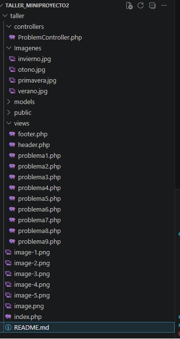
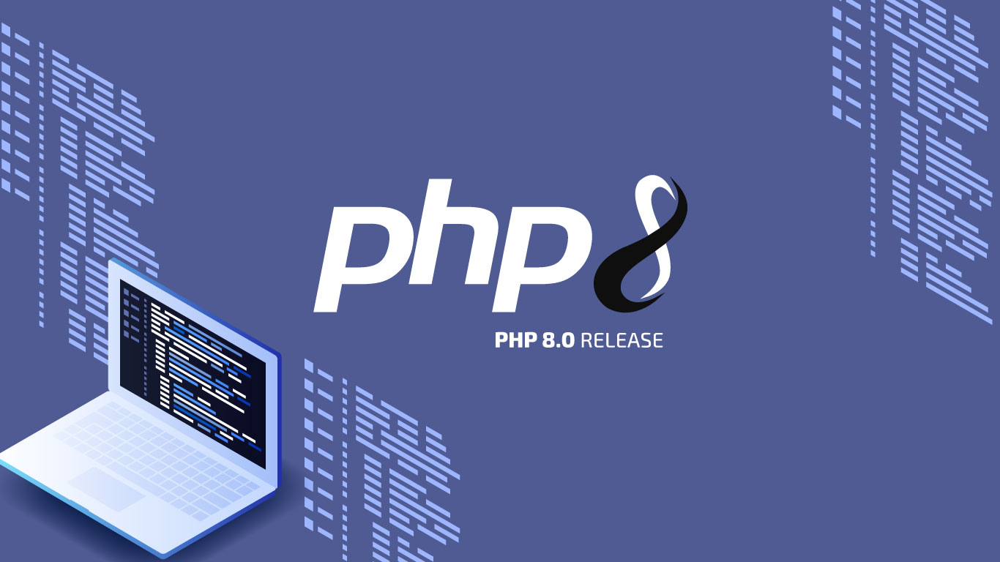
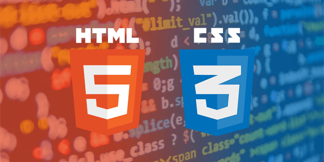
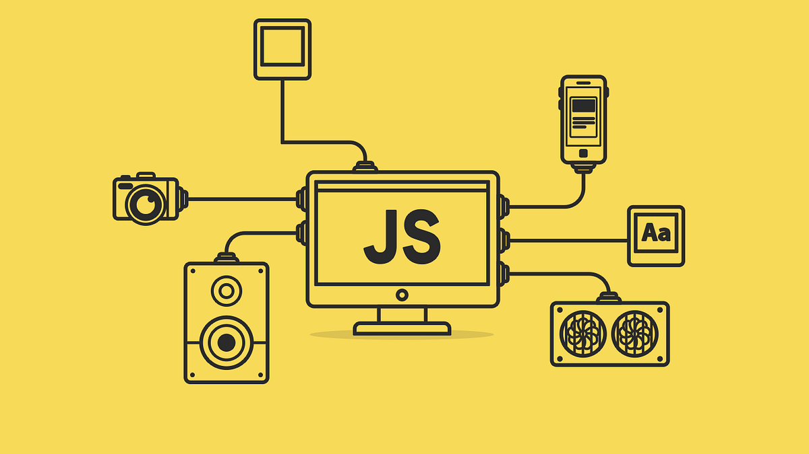
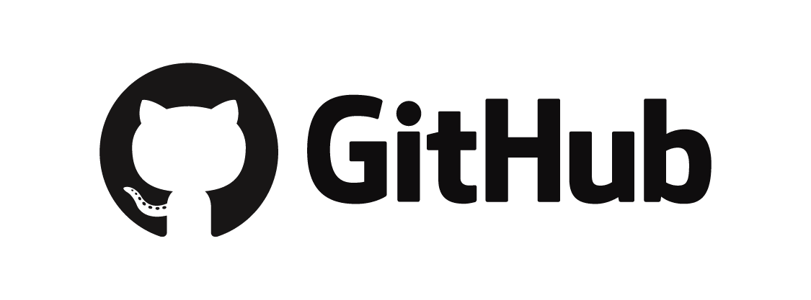
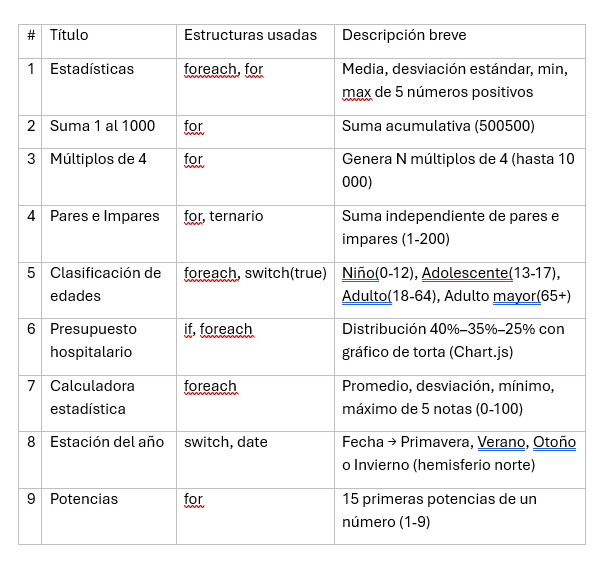

# Mini Proyecto #2 – Desarrollo Web VII

**Universidad Tecnológica de Panamá**  
**Facultad de Ingeniería en Sistemas Computacionales**  
**Desarrollo Web VII** – Ing. Irina Fong  

**Integrantes:**  
- Arely Mendoza  
- Estrella Pino  

**Fecha de realización:** 7 de Junio del 2026  

---

## Descripción del Proyecto

Este proyecto resuelve **9 problemas de programación** en PHP utilizando estructuras de control (if, switch, for, foreach), arreglos, funciones y una clase utilitaria con métodos estáticos. Cada problema se presenta en una vista independiente, unificada bajo un mismo diseño visual moderno (colores rosa, tipografía Poppins, sombras y bordes redondeados). El proyecto sigue el patrón **MVC** y aplica buenas prácticas como **DRY**, **OWASP** y **PSR-1**.

---

## Estructura del Proyecto



---

## Cómo ejecutar el proyecto

1. **Requisitos**:  
   - Servidor local (XAMPP, WAMP, o PHP built-in server).  
   - PHP 7.4 o superior.  
   


2. **Pasos**:  
   - Clona el repositorio:  
     ```bash
     git clone https://github.com/Arely200/MiniProyecto.git


## nologías utilizadas
PHP 8 (lógica del servidor, formularios, sesiones CSRF opcionales)
 

HTML5 + CSS3 (diseño responsive, variables CSS, animaciones).



JavaScript (gráfica Chart.js en problema 6).



Git / GitHub (control de versiones).



## Patrón MVC y Clase Utilidades
Modelo: La clase Utilidades.php centraliza toda la lógica de negocio: validación de números, sanitización (htmlspecialchars), cálculos estadísticos (media, desviación estándar, potencias) y generación del enlace "Volver al menú".

Vista: Los archivos problema*.php, header.php y footer.php manejan la presentación.

Controlador: ProblemController.php recibe el parámetro ?problema=N e incluye la vista correspondiente, con manejo seguro de errores (no expone rutas internas).

Principio DRY: El header y footer se reutilizan en todas las vistas; el enlace de vuelta al menú se genera mediante un solo método estático

## Seguridad (OWASP)
Prevención de XSS: Uso de Utilidades::limpiarHtml() (que encapsula htmlspecialchars) en toda salida de datos del usuario.

Validación de entradas: Métodos validarNumero, validarRango, validarEnteroPositivo basados en filter_var.

Gestión de errores segura: El controlador no muestra mensajes de error de PHP; redirige o muestra un mensaje genérico en caso de problema no encontrado.

## Problemas resueltos


## Diseño visual
Fuente principal: Poppins (Google Fonts).

Paleta de colores: Rosa (#ff4a70), oscuro (#2d181b), gris medio (#63474a), blanco.

Efectos: Sombras pronunciadas, bordes redondeados, animación de entrada y fondo con cuadrícula animada.

Responsive: Se adapta a móviles (los inputs se apilan en columnas).

##  Lecciones aprendidas
La integración de dos estilos diferentes (el original del alumno y el de la compañera) requirió unificar clases CSS y variables.

La caché del navegador fue un obstáculo para ver los cambios de estilo; se resolvió añadiendo parámetros de versión o limpieza manual.

El uso de métodos estáticos en Utilidades simplificó la reutilización y el mantenimiento del código.

## Autoras
Arely Mendoza – Implementación de lógica PHP, diseño CSS, integración de problemas 1-5 y 9.

Estrella Pino – Implementación de lógica PHP, diseño CSS, integración de problemas 6, 7, 8 y gráficas.